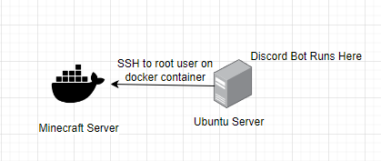
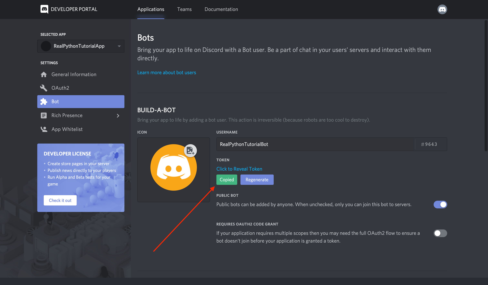
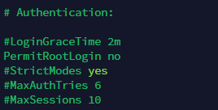

# How to integrate a Discord Bot with your Minecraft Server
## Overview
This project spawned because I currently host a minecraft server for my friends and I. Minecraft servers are notorious for being buggy especially when they run off the Vanilla jar file and because of that my server would occasionally crash.  Sometimes I was home to restart the container I was running it in but most of the time I wasnt so I had to use my vpn to go into my home network and restart everything which was kind of tedious. So I gave the power to the people. I created a Discord Server, invited my friends, and then created a discord bot that could be used to check, stop, or restart the server at anytime without the need for me to be at my computer or home. 

### Assumptions
Before you start implementing this just know that this guide assumes a couple of things about your knowledge: 
1. that you somewhat understand what python is and how it works
1. the security vulnerabilities and implications of using a bot to interact with resources on your home network can have
1. what ssh is
1. how to configure port forwarding by yourself

If you want this to work the best and be easy to understand you can replicate my setup in some form or another. Below is an image of how I run this bot and minecraft server. Whether you run the container on the ubuntu host or elsewhere I recommend putting minecraft in its own container since it uses a decent amount of resources.  
  
**I am not responsible for any misuse or problems you encounter by implementing my code into your own environment!**

## Setup ##
First clone this repository in a directory you have control of on your ubuntu machine. All files mentioned in this tutorial, aside from the minecraft server file, will be found in the repository.

### Discord Bot ###
There are plenty of tutorials on how to set up a discord bot so I will not be going over that. Here is the [link](https://realpython.com/how-to-make-a-discord-bot-python/) that I used to create my bot. I gave my bot admin privileges since I control the code. I would suggest you give it most privileges since it will need to send messages to users and channels as well as read messages to look for commands. The only thing the code needs to run is a bot with sufficient privileges and the bot token that can be found in the developer portal 

### Editing Code for your Server
Once you have invited your bot to your discord server you are ready to start editing the code so it can start interacting with your minecraft server.

To begin copy your discord bot token and past it into the `.env.example` file on the other side of the `DISCORD_TOKEN` variable. While you are there change the name from `env.example` to `.env`. This will allow the bot to bring in this sensitive variable into the python file so you dont have to hard code it in there.

Next you will need to open up the `server_commands.sh` file. An sh file is a file that can be run on a Linux machine to execute a set of commands. In order for this file to work you will need to do/have the following:
- type `sudo chmod +x server_commands.sh` This gives the script the ability to run
- Your minecraft server running on a linux (preferably Ubuntu or Alpine Linux) machine or container
- Know the IP address of your minecraft server and have root privileges
- Have the screeen package installed. If you dont have it run `sudo apt update && sudo apt install screen -y`
- Setup up ssh key for root user.
    - On your linux machine (not the minecraft server), type `ssh-keygen -t rsa -b 4096` it will prompt you for a couple things. Just hit enter until it stops to use the default location and options
    - From there type `ssh-copy-id $HOME/.ssh/id_rsa.pub root@\<your-minecraft-server-ip\>`
- You will have to edit the `/etc/ssh/sshd_config` file to allow root login. Change `PermitRootLogin no` to `PermitRootLogin prohibit-password`. This will enable it to login in with the ssh key you have set up  

Alright the hard part is over! Now all you have to do is change the lines in the server_commands.sh file that have `ssh root@192.168.86.22` to `ssh root@<your-minecraft-server-ip/>`
### Crontab
Crontab is a way that the computer can run commands on a schedule that you set. In order for the reboot to restart you server you will need to do the following:

- As the root user on your minecraft container/machine, type `mkdir ~/minecraft_server`
- then you will need to download the server jar file you need for your minecraft version and store it in that directory. For `1.19.3` you can use this command: `cd ~/minecraft_server && wget https://piston-data.mojang.com/v1/objects/c9df48efed58511cdd0213c56b9013a7b5c9ac1f/server.jar`
- then type `sudo crontab -e`
- then at the bottom of the file type `@reboot screen -dmS minecraft bash -c "java -server -Xms6G -Xmx8G -jar ~/minecraft_server/server.jar nogui; exec bash"`

Ok from there you should be all set. Restart your minecraft container/machine and your server should be up. 

**NOTE**  
You will need to figure out port forwarding for yourself, its too extensive to cover in this tutorial

### Interacting with your Server
This is the easy part. Now on your ubunut machine navigate to where you clone this repository. then do `chmod +x run_bot.sh` then type `./run_bot.sh` your bot should be running. Check your discord server to see if it is online. If it is online message it and type `!status` to see if your commands are working. If they are great! If they arent look at the troubleshooting section

## Troubleshooting ##

- Here are a couple things to check/try before any serious troubleshooting
    - see if you can ping your minecraft machine from your ubuntu machine by doing `ping <minecraft-server-ip\>`
    - Try the ssh commands from the script in the terminal by themselves and troubleshoot any errors. Try this one `ssh root@your-minecraft-machine-ip 'screen -S minecraft -p 0 -X stuff "say Hello Everyone^M"'`. Then check on your minecraft world to see if the server said anything. If it did most, if not all your commands should be working.
    - Make sure you can ssh into the machine and have sudo privileges
    - Look and see if the server is actually running.
    - Make sure your port forwarding is working and that you can connect to your server
